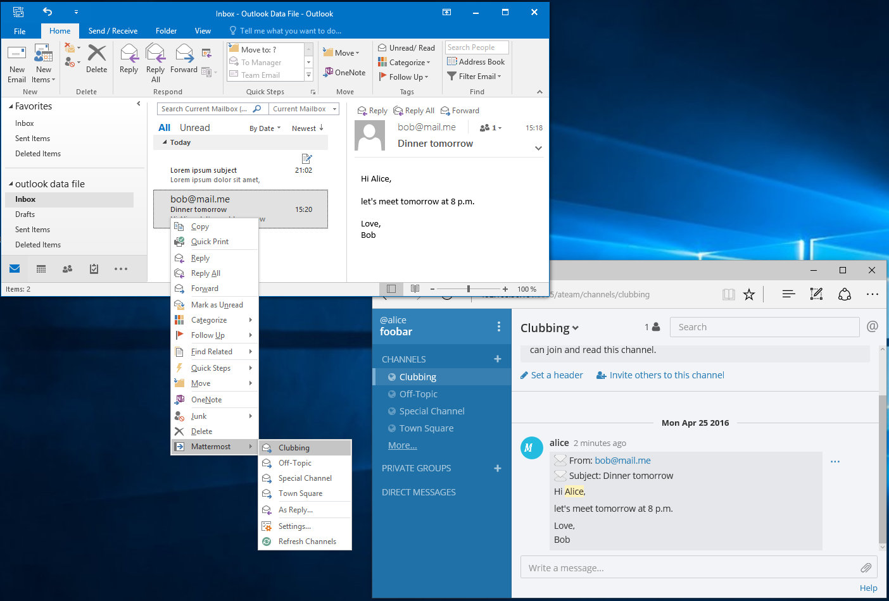

### Introduction
An Outlook Add-in to forward mails to [Mattermost](http://www.mattermost.org/)

### Installation
* Make sure that [Microsoft Visual Studio Tools for Office Runtime 2010](https://www.microsoft.com/en-us/download/details.aspx?id=48217) is installed
* Download the latest binary distribution from the [releases page](https://github.com/makmu/outlook-matters/releases)
* Unzip the release to `C:\Program Files\OutlookMatters` (or any other folder where you want install the binaries)
* Double-Click file `OutlookMatters.vsto` to install the Addin

### Configuration
* In Outlook right-click on any e-mail in your mail folder
* From the context menu select `Mattermost`-> `Settings...`
  * Configure mattermost base url (e.g. `http://mattermost.some-company.com`)
  * team id (e.g. `myteam`)
  * your email address as known to mattermost (i.e. username)

### Usage
* In Outlook right-click on any e-mail in your mail folder that you want to forward to Mattermost
* From the context menu select `Mattermost` -> `Post`

The contents of your mail should now appear in the configured channel.

**Happy Posting :)**

### Build from Source
You'll need the following tools to build this application:

* Microsoft Visual Studio 2015 Community
* Microsoft Web Developer Tools (installed via the Visual Studio Setup)
* Microsoft Visual Studio Tools for Applications 2012 [Download]( https://www.microsoft.com/de-DE/download/details.aspx?id=38807)
* Microsoft Visual Studio Tools for Office Runtime 2010 [Download](https://www.microsoft.com/en-us/download/details.aspx?id=48217)
* Microsoft Office Developer Tools for Visual Studio 2015 [Download](https://www.visualstudio.com/en-us/features/office-tools-vs.aspx)

### Contributing
We'd like **YOU** to make outlook-matters great! Be it by providing us [feedback](https://github.com/makmu/outlook-matters/issues) or by contributing to our codebase. There are a few [guidelines](CONTRIBUTING.md) that we need all contributors to follow so that we can have a chance of keeping on
top of things.
